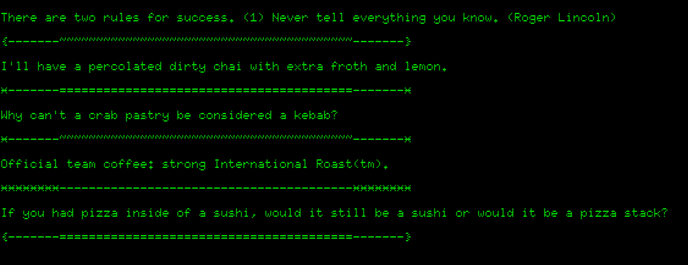

# How To Distract Your Colleagues With Tracery

This repo has some simple example code for a procedural text generator
that you can plug into a screensaver to distract your team-mates while
you are away from your machine.

## Components

The generator has a few sub-generators, all made in `tracery`, the
Python Tracery module. These are:
   
   * Coffee order generator
   * A food ontology puzzler
   * Random quotes
   * Fancy delimiters

## Example

